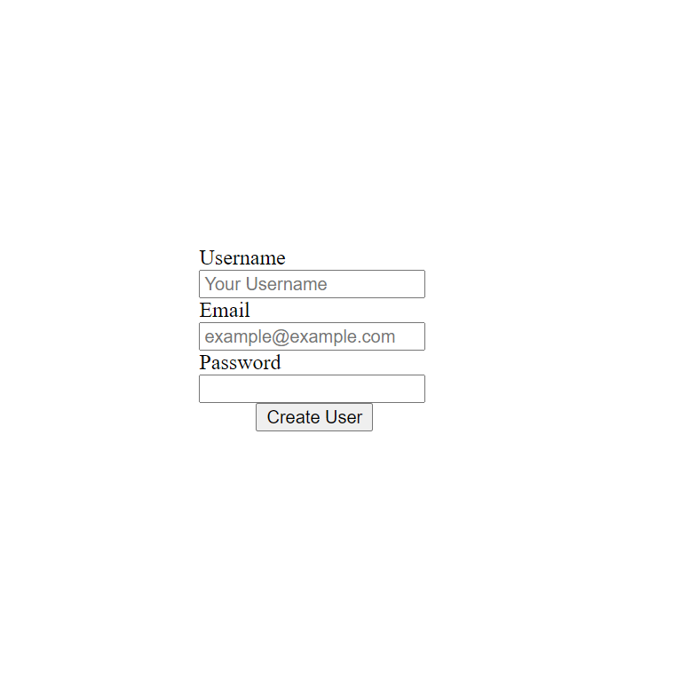

# Re-former

> Forms built using the rails form method helpers.

In this project we build a form to create new or edit existing users.

## Built With

- Ruby
- Ruby on Rails
- SQLite3

To get a local copy up and running follow these simple example steps.

### Prerequisites

- Ruby
- Ruby on Rails
- SQLite3
- yarn
- Node.js

### Setup

- Clone the project with `git clone https://github.com/sjcco/re-rormer`

### Usage

- Visit [this page](http://localhost:3000/) to create a new user
- To edit an existing user you need the user id and replace it in this link (http://localhost:3000/user/:userid/edit)

## Authors

👤 **Juan Carlos Campos**

- GitHub: [@sjcco](https://github.com/sjcco)
- Twitter: [@CarlosCamposO](https://twitter.com/CarlosCamposO)

## 🤝 Contributing

Contributions, issues, and feature requests are welcome!

Feel free to check the [issues page](https://github.com/sjcco/re-rormer/issues/).

## Show your support

Give a ⭐️ if you like this project!

## Acknowledgments

- Hat tip to anyone whose code was used
- Inspiration
- etc

## 📝 License

This project is [MIT](lic.url) licensed.
